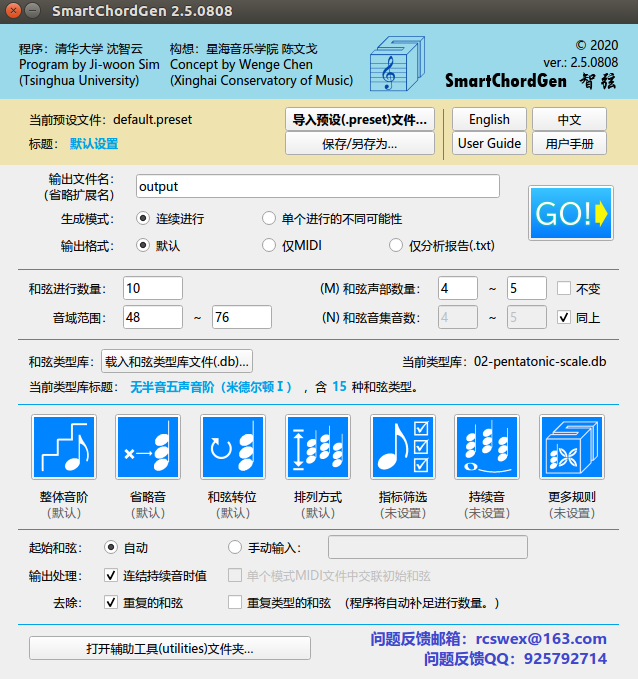

# ChordQ 智弦 - 无限和声生成器
（原名：SmartChordGen 智弦 - 无限和声生成器）
# 招募公告：本软件功能已基本完善，现招募移动App（iOS，Android）及网页版移植开发者，报酬面议（不低于10000元）。有意者请询 rcswex@163.com、QQ：925792714。

# 重要公告：此版本（v3.0，2020年12月11日发布）为 SmartChordGen 的最后一次更新，「终极和弦替代器（The Ultimate Chord Substitutor）」功能、完整用户手册和全新界面将在下次更新发布，届时软件名称同时变更为 ChordQ （中文名称不变）。
# 生成音乐试听：https://music.163.com/#/album?id=93026223
# by Ji-woon SIM (Tsinghua Univ.) and Wenge CHEN (Xinghai CoM.)
# 作者：清华大学  沈智云[1]（程序设计），  星海音乐学院  陈文戈[1]（构想与调试）
# Latest Release 最新版本：v2.5r2 [20201108] Downloads 下载 ↓ 
# Windows 版： https://github.com/Chen-and-Sim/SmartChordGen/releases/download/v2.5/SmartChordGen.v2.5.0808.Windows.exe
# Linux 版：https://github.com/Chen-and-Sim/SmartChordGen/releases/download/v2.5/SmartChordGen.v2.5.0808.Linux.zip
# 下载慢：提供百度网盘下载 链接：https://pan.baidu.com/s/1s9jKZGTwUfPz5tQCxfLbLg ，提取码：1234
# [ 太长不看版 README：本软件免费开源；另将推出两个功能更完善的商业版本，售价分别为 RMB 39 和 RMB 99。运行程序请在 Release 下载打开 \bin\SmartChordGen.exe ；聆听示例音乐请打开 \samples\ ；默认输出文件路径为 \output\。源文件在 repo 根目录的 source 文件夹，开源协议是 GNU GPLv3。 ]
# 更多 README 请见：【使用前阅读】README.pdf。
